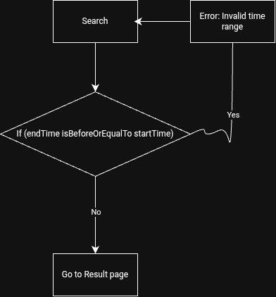

# Requirement
We need to create a list of shops and connect them with potential users. We already have connections. The idea is similar to booking.com or Agoda page

# System analysis for booking website
The website consists of 6 pages, a header and a footer

## 1. Landing page
The most important page, consists of 7 sections: header, footer and the following main sections:

### 1.1. Hero section
Include a place to advertise, and a booking form for customers to book services. 
* To advertise the page: change background image, use title, subtitle...
* To book services: booking form with: services (body, massage...), date picker, time picker, in pill styles. And button "Search".

User can choose services from dropdown list. Default is "All treatments and venues". If user choose it, they will choose all services.

User can choose date from date picker. Default is today’s date. All previous day is disabled.

User can choose time from time picker. Default start time is "00:00" and end time is "24:00".

When user clicks button "Search", the system will check if start time is before end time. If this is a case, throw an error. If not, redirect to result page.



### 1.2. List of new partners
Show the list of new shops, in slideshow of 3 cards.
Each card contains basic information: first photo of shops, name, star rating, number of ratings, address, list of services provided

### 1.3. List of recommended partners
Same as above, but show the list of recommended shops, in slideshow of 3 cards.

### 1.4. Browse by districts
Show the list of districts, in tab form. Each tab contains: name of district.

When user clicks on each tab, the system will show the list of shops in that district, in slideshow of 3 cards.
Each cards contains the same information as above.
 
### 1.5. Testimonials
A place to show the reviews from customers (mostly positive reviews). Should be shown as a slideshow of cards. Each card contains: image and name of customer, his review, his star rating.

## 2. Header
A logo/text redirect to home page

A menu (no link at that time)
* FAQ
* Contact / About us
* Become a partner

## 3. Footer
Contain 4 sections:
* Section 1: a logo and information (phone, address…)
* Section 2: link to social network
* Section 3: Privacy policy, terms and conditions, about us

## 4. Result page

After searching, the system will redirect to result page to choose the options. The page consists of: header, footer and main section.

In main section:
* First, user can see a breadcrumbs: current page’s location within a navigational hierarchy.
* Then, user can see a search form, with search criteria passed from landing page. To refine the search, user can fill in keywords (same as in landing page) and click button "search".
* Then, a filter on the left. The filter includes:
  - Name: text box to fill in the name of shops
  - Available time: Time picker to choose the available time
  - Star rating: range to choose minimum star rating
  - District: checkbox to choose available districts

* The options are on the right, are a list of shops, each with basic information, the same as in hero section. 

User then can look at each shop, see if shop is a match, choose it to see details (redirect to detail page). Or a button "Book now" to book directly.

When user clicks button "Book now", the system will redirect to detail page with booking section.

### 5. Detail page
(booking detail page)

### 6. Booking and payment pages
After completing it, user will click button "Continue". Their information will be saved in the system and they will be redirected to payment page.
A payment form will appear, showing that they should fill in a detail form (first name, last name, email address, id number, etc...), and button "send request". 
Their information will be saved in the system and they will be redirected to payment page.

# System design
The system will be designed in Component-Based Architecture.

Application will be built with ReactJS framework. The design will be responsive, mobile-first.
From top to bottom of root: 

```tooltip provider -> toaster + routes -> route.``` 

Toaster for notification, as a single component at root level.

## data
The data of shops will be stored in JSON format, in single file ```src/data/partners.json``` file. Each shop will have the following information:

## Landing page 
* Component route path (Index element)

	```App -> / ```

* Code hiearchy 

	```src/pages/Index.jsx```

* Inside Index, we have components for each section:
- Header: ```src/components/Header.jsx```
- Hero section: ```src/components/HeroSection.jsx``` (contain custom dropdown item when searching for services: ```src/components/ui/SearchDropdownItem.tsx``` )
- Service section (cover 1.2, 1.3, 1.4): ```src/components/ServiceSection.jsx``` (contain custom card item for each shop: ```src/components/ui/ServiceCard.tsx``` )
- Testimonials section: ```src/components/Testimonials.jsx```
- Footer: ```src/components/Footer.jsx```

## Result page
* Component route path 

	```/results ```

* Code hiearchy 

	```src/pages/Results.jsx```

* Inside Result, we have components for each section:
- Header: ```src/components/Header.jsx```
- Breadcrumb: ```src/components/Breadcrumb.jsx```
- Search form: ```src/components/SearchForm.jsx``` (contain custom dropdown item when searching for services: ```src/components/ui/SearchDropdownItem.tsx``` )
- Filter: ```src/components/Filter.jsx```
- Shop list: ```src/components/ShopList.jsx``` (contain custom card item for each shop: ```src/components/ui/ServiceCard.tsx``` )

## Detail page
* Component route path for each shop detail, retrieved and rendered by id of the shop (Detail element)

	```App -> /results/:id```

* Code hiearchy 

	```src/pages/Details.jsx```

## Booking page
* Component route path for each booking detail, retrieved when clicking "book now" in each shop (Booking element)

	```App -> /results/:id/booking```

* Code hiearchy 
	```src/pages/Booking.jsx```

## Not found page route:
* Component route path (NotFound element)

	```App -> *```

* Code hiearchy

```src/pages/NotFound.jsx```

# Tech stack
* Frontend: ReactJS, Boostrap 5, react-boostrap, lucide-icons, react-router-dom, react-datepicker, react-boostrap-time-picker