# Requirement
We need to create a list of shops and connect them with potential users. We already have connections. The idea is similar to booking.com or Agoda page.
The website is mainly a clone of https://www.fresha.com, with different booking flow.

Main Flow chart:

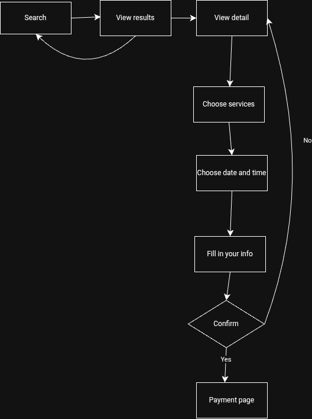

# System analysis for booking website
The website consists of 6 pages, a header and a footer

## 1. Landing page
The most important page, consists of 7 sections: header, footer and the following main sections:

### 1.1. Hero section
Include a place to advertise, and a booking form for customers to book services. 
* To advertise the page: use background image, use title, subtitle...
* To book services: booking form with: services (body, massage...), date picker, time picker, in pill styles. And button "Search".

User can choose services from dropdown list. Default is "All treatments and venues". If user choose it, they will choose all services.


User can choose date from date picker. Default is today’s date. All previous day is disabled.

User can choose time from time picker. Default start time is "00:00" and end time is "24:00".

When user clicks button "Search", the system will check if start time is before end time. If this is a case, throw an error. If not, redirect to result page.

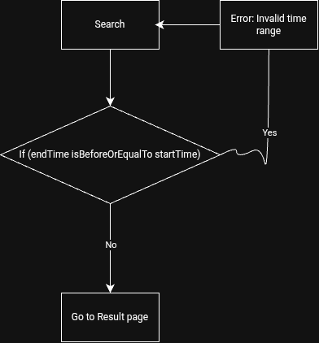

### 1.2. List of new partners
Show the list of new shops, in slideshow of 3 cards.
Each card contains basic information: first photo of shops, name, star rating, number of ratings, address, list of services provided

### 1.3. List of recommended partners
Same as above, but show the list of recommended shops, in slideshow of 3 cards.
 
### 1.4. Testimonials
A place to show the reviews from customers (mostly positive reviews). Should be shown as a slideshow of cards. Each card contains: image and name of customer, his review, his star rating.

## 2. Header
A logo/text redirect to home page

A menu (no link at that time)
* FAQ
* Contact / About us
* Become a partner

## 3. Footer
Contain 4 sections:
* Section 1: a logo and information (phone, address…)
* Section 2: link to social network
* Section 3: Privacy policy, terms and conditions, about us

## 4. Result page

After searching, the system will redirect to result page to choose the options. The page consists of: header, footer and main section.

In main section:
* First, user can see a breadcrumbs: current page location within a navigational hierarchy.
* Then, user can see a search form, with search criteria passed from landing page. To refine the search, user can fill in or choose keywords (same as in landing page) and click button "search".

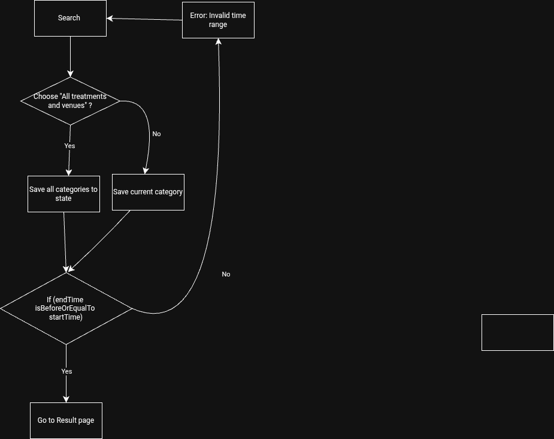

* Below is the options, which are a list of shops, filtered by "search", each with basic information, the same as in hero section.

User then can look at each shop, see if shop is a match, choose it to see details (redirect to detail page). Or a button "Book now" to book directly.

When user clicks button "View detail", the system will redirect to detail page.

### 5. Detail page
The page gets id of the shop passed from "Result page". "id" is the index of shop in partners.json. 
If the shop is not found, show a simple message: Shop not found. And button / link to come back.
Else: The page consists of: header, footer and main section.

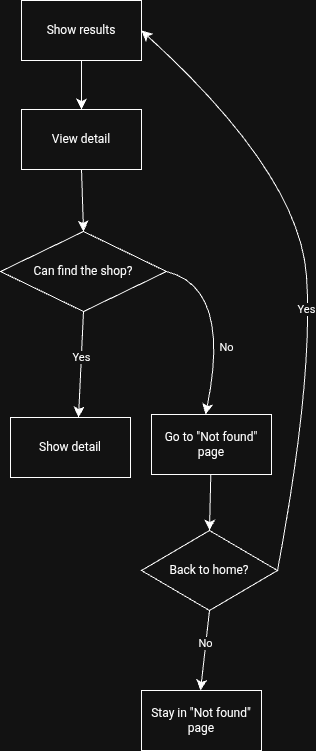

In main section:
* First, user can see a breadcrumbs: current page location within a navigational hierarchy (Home -> Shops -> [name of shop]). If user click on "Shops", the website will redirect to Result page.
* Then a section which contains basic information of current shop: name (in one row), rating, number of ratings, open or not at this moment, address (in another row below), and all photos.

* The final section contains 2 parts and has similar look with this one

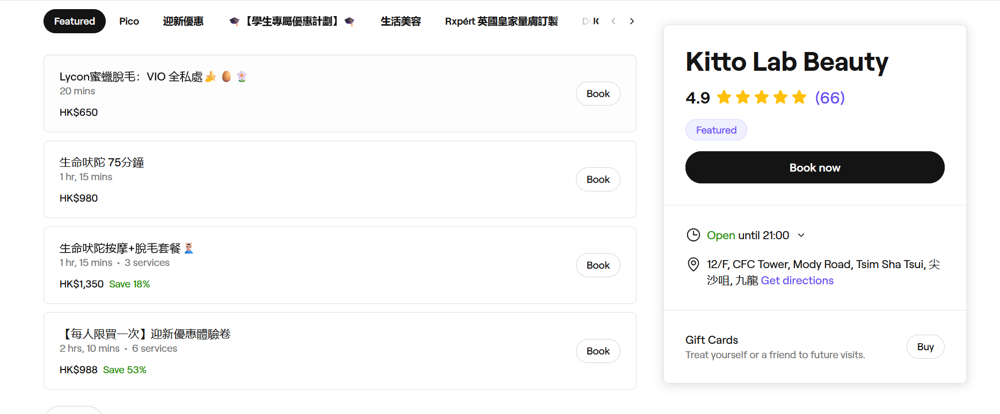
  - Detail information: on the left, contains:
	- All services in tab view (data: get from props "services" in partners.json). Each tab contains: type of service, all items in this service. Each item has name, duration and cost. There's an additional tab: Featured. If an item has props "featured" = true, they will also be displayed here.
	- Below is "reviews" section (get data from props "reviews" in partners.json), with header "Reviews", overall rating, number of ratings. Then each review card is displayed as below, with information: avatar, name of reviewer, day and time of review, his/her comment and rating.

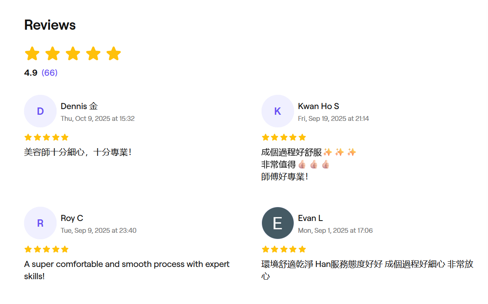

	- Below is "about" section (get data from props "about" in partners.json), with header "About" and content. Then the address with link to it on Google map.
	- Below is "opening times" and "additional information" (get data from props "openingTimes" and "additionalInfo" in partners.json), as shown in below.
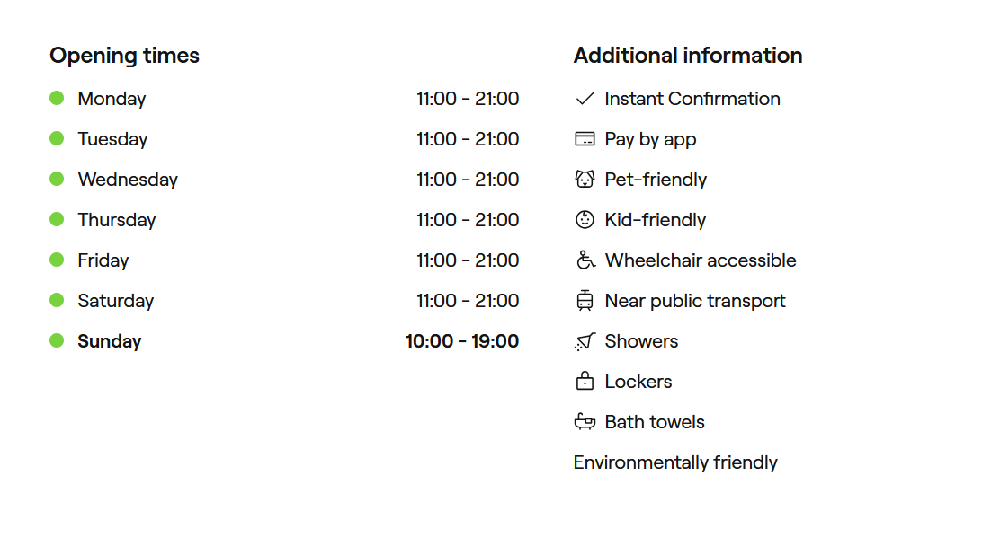

  - Booking place: contains basic information again (as shown in image below). When user click in "open at...", a place will appear, showing opening times in detail.


When user click in "Book now", they will be redirected to booking and payment pages.

### 6. Booking and payment pages
In booking page, user will go through a booking process when they will book services => book date and time => fill in information form => confirm their booking.
The booking page therefore contains 2 sections:
* The left section: contains booking process.
	* First, user will book services of the shop. 
		* The services is shown in tab view like in detail page, but each item has button "+". When user click on it, the service will be added and appear in the right section with price and button "x", and total cost will be updated. When user click on "x", the service will be removed. Total cost is also updated as well.

		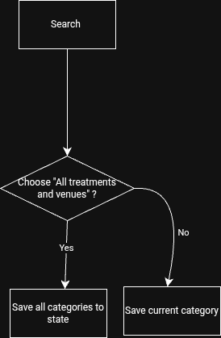

		* After choosing services and click "continue", they will be redirected to date and time  section where they can choose time to use services. If no date selected, default is current date. If no time selected, default is current time.

		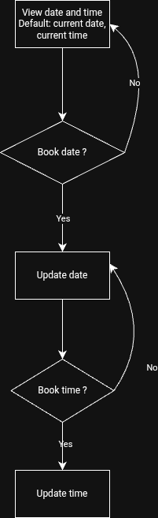

		* Information section requires user to fill in: email, name, phone, address, district, city.

	* The right button: booking information here. Displaying: booked services, date and time, total duration, their information, and total cost. If user doesn't book any service, the text "no service selected" will display, and button "Continue" will be blurred, meaning user cannot continue without booking any service. Total cost will be set to "0 VND". If there's at least one service selected, total cost = sum of services' costs. 
	
	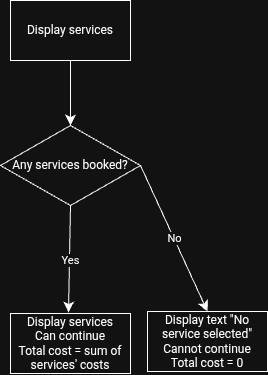

	If user don't set date and time, the text "no date selected" will display. 

	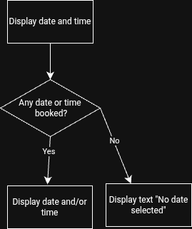

	Each piece of information will display in one line, with icons on the left.

After completing it, user will click button "Continue". Their information will be saved in the system and they will be redirected to payment page.

# System design
The system will be designed in Component-Based Architecture.

Application will be built with ReactJS framework. The design will be responsive, mobile-first.
From top to bottom of root: 

```tooltip provider -> toaster + routes -> route.``` 

Toaster for notification, as a single component at root level.

## data
The data of shops will be stored in JSON format, in single file ```src/data/partners.json``` file. Each shop will have the following information:

## Landing page 
* Component route path (Index element)

	```App -> / ```

* Code hiearchy 

	```src/pages/Index.tsx```

* Inside Index, we have components for each section:
- Header: ```src/components/Header.tsx```
- Hero section: ```src/components/HeroSection.tsx``` 
	- contain custom dropdown item when searching for services: ```src/components/ui/SearchDropdownItem.tsx``` 
	- and custom toast when error occurs
- Service section (cover 1.2, 1.3, 1.4): ```src/components/ServiceSection.tsx``` 
	- contain custom card item for each shop: ```src/components/ui/PartnerCard.tsx```
	- each card contain custom star rating: ```src/components/ui/StarRating.tsx```
- Testimonials section: ```src/components/Testimonials.tsx```
- Footer: ```src/components/Footer.tsx```

## Result page
* Component route path 

	```/results ```

* Code hiearchy 

	```src/pages/Results.tsx```

* Inside Result, we have components for each section:
- Header: ```src/components/Header.tsx```
- Breadcrumb: Custom Breadcrumb (used for many pages): ```src/components/MyBreadcrumb.tsx```
- Search form: ```src/components/SearchForm.tsx``` 
	- contain custom dropdown item when searching for services: ```src/components/ui/SearchDropdownItem.tsx``` 
	- and custom toast when error occurs
- Filter: ```src/components/Filter.tsx```
- Shop list: ```src/components/ResultList.tsx``` 
	- contains custom card item for each shop: ```src/components/ui/PartnerCard.tsx```
	- each card contains custom star rating: ```src/components/ui/StarRating.tsx```

## Detail page
* Component route path for each shop detail, retrieved and rendered by id of the shop (Detail element)

	```App -> /results/:id```

* Code hiearchy 

	```src/pages/Detail.tsx```

* Inside Detail, we have components for each section:
- Header: ```src/components/Header.tsx```
- Breadcrumb: same as above: ```src/components/MyBreadcrumb.tsx```
- Basic information: name, star rating, number of ratings, close or open now, address.
	- contains custom star rating: ```src/components/ui/StarRating.tsx```
- Service section: ```src/components/ServiceTabs.tsx```
	- each tab contains custom service card for each item: ```src/components/ServiceCard.tsx```

## Booking page
* Component route path for each booking detail, retrieved when clicking "book now" in each shop (Booking element)

	```App -> /results/:id/booking```

* Code hiearchy 
	```src/pages/Booking.tsx```

## Not found page route:
* Component route path (NotFound element)

	```App -> *```

* Code hiearchy

```src/pages/NotFound.tsx```

## Custom component UI (in ./src/components/ui)
### SearchDropdownItem
Used for selecting category in search form, in landing page and result page.
Interface of each dropdown item with icon from lucide-react, and category from partners.json:
```
interface DropdownItemProps {
    icon: LucideIcon;
    category: string;
    onClick?: () => void;
}
```
Map categories to lucide-react icons:
```
const categoryIconMap: Record<string, LucideIcon> = {
    "Body": PersonStanding,
    "Eyebrows and eyelashes": Eye,
    "Facials and Skincare": SmilePlus,
    "Hair and Styling": Sparkles, 
    "Injectables and fillers": Syringe, 
    "Makeup": Palette,
    "Massage": HandHeart,
    "Medical and dental": BriefcaseMedical,
    "Nails": Hand,
};
```
### MyBreadCrumb
Breadcrumb that can be re-used for landing page, detail page, and (with different implementation) in booking page.

# Tech stack
* Frontend: ReactJS, Boostrap 5, react-boostrap, lucide-icons, react-router-dom, react-datepicker, react-boostrap-time-picker, sonner